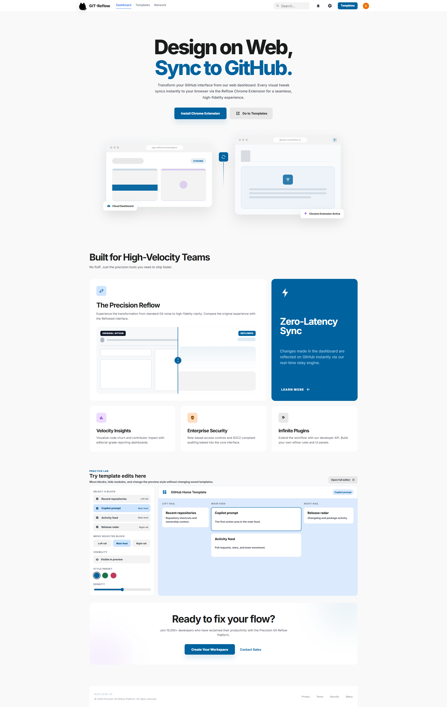
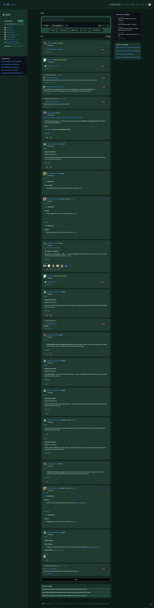
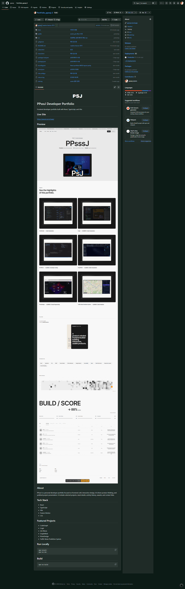
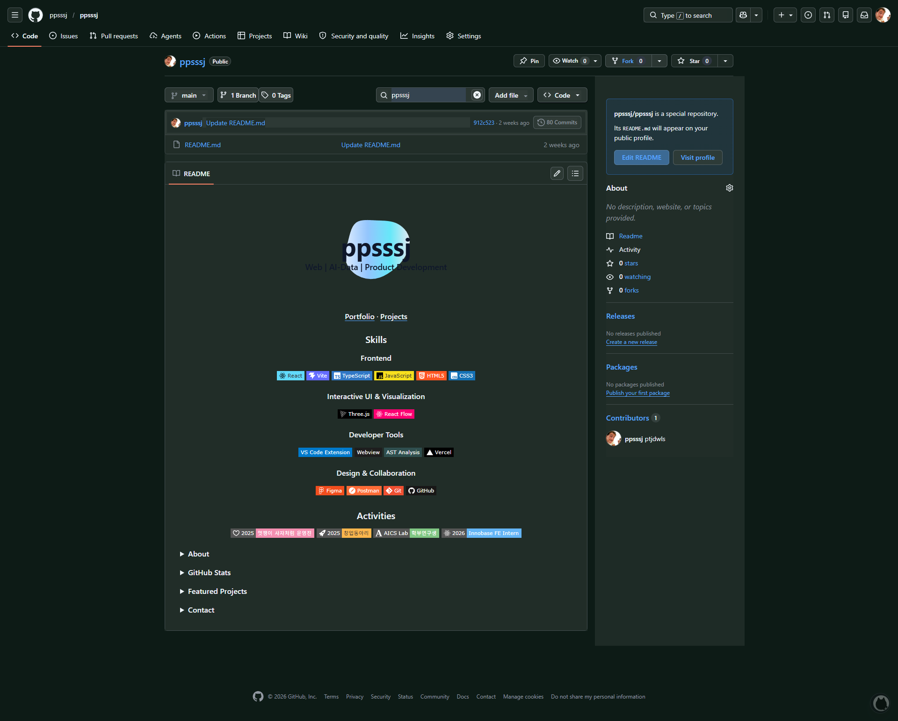
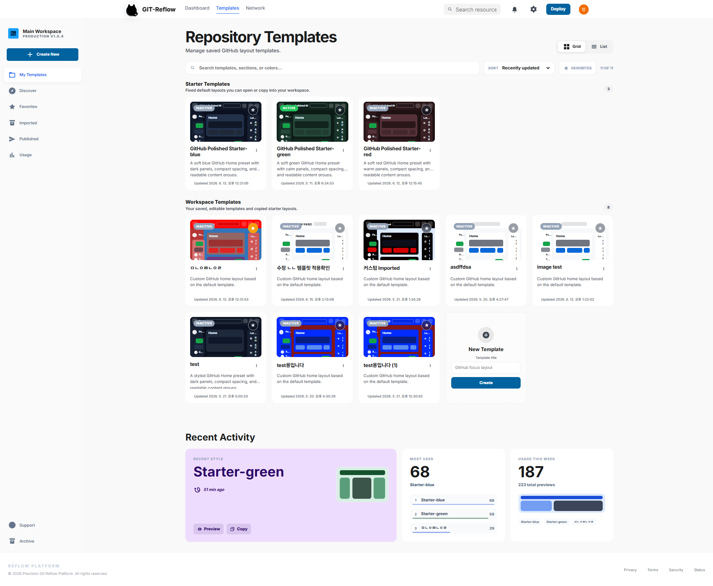
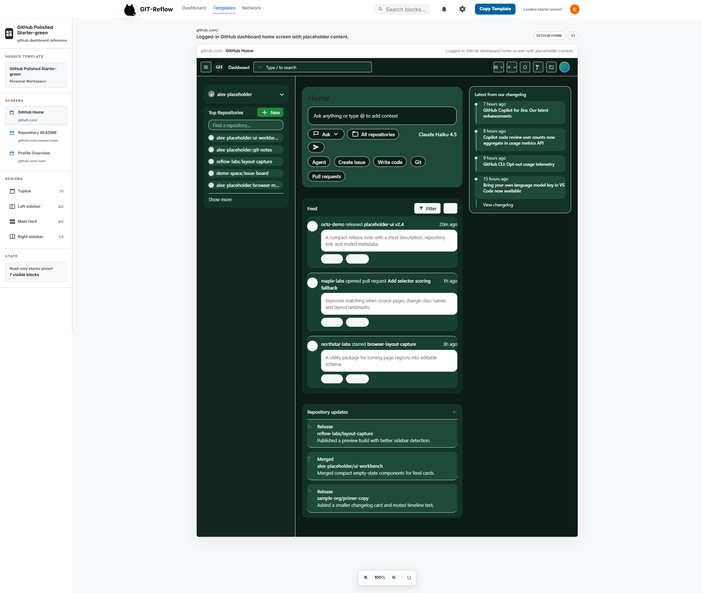
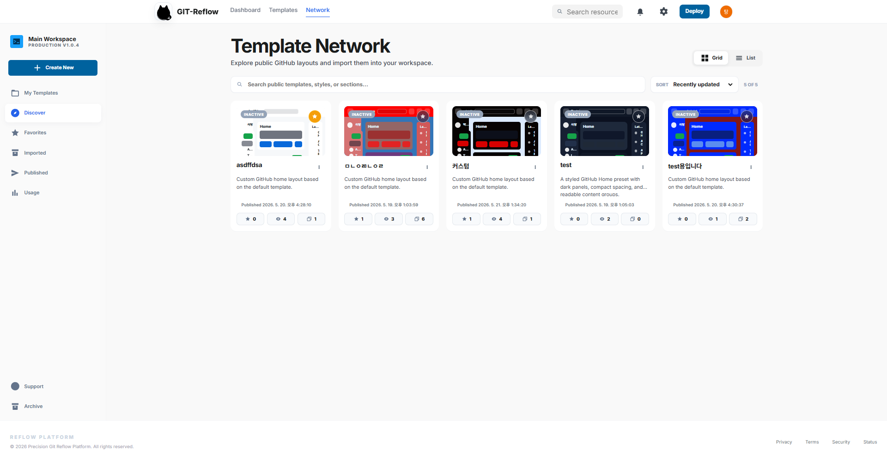
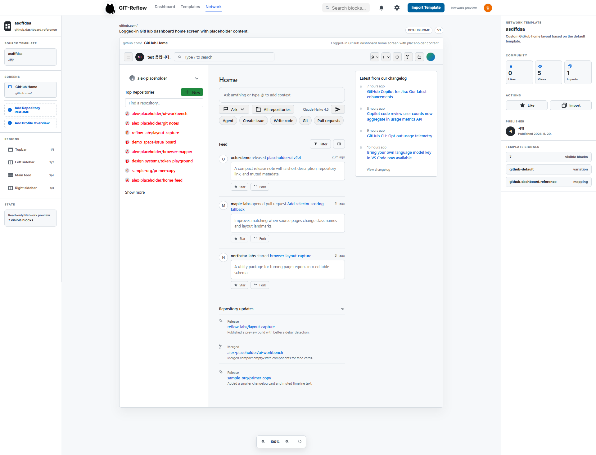
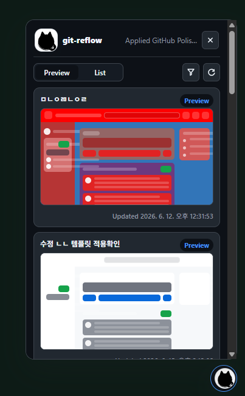

<p align="center">
  
</p>

<h1 align="center">GIT-Reflow</h1>

<p align="center">
  웹 대시보드에서 GitHub 레이아웃 템플릿을 만들고, Chrome Extension으로 실제 GitHub 화면에 적용하는 UI 커스터마이징 도구입니다.
</p>

<p align="center">
  
  
  
  
  
  
</p>

## Overview

GIT-Reflow는 GitHub의 Home, Repository README, Profile Overview 화면을 사용자가 원하는 색상과 구조로 재배치할 수 있게 해줍니다.

웹 앱에서는 템플릿을 만들고 편집하며, Chrome Extension은 저장된 최신 템플릿을 읽어 실제 GitHub DOM에 스타일과 레이아웃을 적용합니다. 기본 템플릿을 복사해서 시작할 수 있고, 만든 템플릿은 Network에 공개하거나 다른 템플릿을 가져와 사용할 수 있습니다.

<p align="center">
  
</p>

## GitHub에 적용된 모습

| GitHub Home | Repository README |
| --- | --- |
|  |  |

| Profile Overview |
| --- |
|  |

## 주요 기능

- GitHub Home 템플릿 편집: topbar, left sidebar, main feed, right sidebar 블록 구성
- Repository README 화면 지원: 파일 목록, README, About 사이드바 스타일 적용
- Profile Overview 화면 지원: 프로필 사이드바, README, pinned repositories, contributions 영역 적용
- 블록별 색상, 내부 배경, 텍스트, 링크, 간격, radius 조정
- Starter 템플릿 제공: blue, green, red 프리셋
- 템플릿 저장, 복사, 삭제, 즐겨찾기, 사용량 확인
- Template Network: 공개 템플릿 탐색, 미리보기, 좋아요, import
- Chrome Extension을 통한 실제 GitHub 화면 적용

## 웹 앱 화면

### Template Library

저장한 템플릿과 starter 템플릿을 한 곳에서 관리합니다. Grid/List 보기, 검색, 정렬, 복사, 공개, 가져오기 흐름을 제공합니다.

<p align="center">
  
</p>

### Template Editor

GitHub 화면을 screen 단위로 나누고, 각 region의 block을 숨기거나 옮기면서 미리보기 스타일을 조정합니다.

<p align="center">
  
</p>

### Template Network

다른 사용자가 공개한 템플릿을 탐색하고, 상세 미리보기에서 import할 수 있습니다.

| Network List | Network Preview |
| --- | --- |
|  |  |

## 프로젝트 구조

```text
git-reflow/
  assets/             # README와 문서용 스크린샷
  Extension App/      # Chrome Extension Manifest V3, content script
  packages/
    shared/           # 템플릿 타입과 런타임 검증 로직
  web/
    BE/               # Node.js API 서버, SQLite 저장소
    FE/               # React + TypeScript + Vite 웹 앱
```

## 기술 스택

| 영역 | 기술 |
| --- | --- |
| Frontend | React 18, TypeScript, Vite, React Router |
| Backend | Node.js HTTP server, better-sqlite3, dotenv, google-auth-library |
| Auth | Google Identity Services, Google ID token verification |
| Storage | SQLite, legacy JSON migration |
| Extension | Chrome Extension Manifest V3, Content Script, Chrome Storage |
| Shared Contract | TypeScript types, JavaScript runtime validator |

## 빠른 실행

### 1. 환경 변수 설정

`web/BE/.env.example`을 복사해 `web/BE/.env`를 만들고 Google OAuth Client ID를 입력합니다.

```env
PORT=8787
GOOGLE_CLIENT_ID=your-google-oauth-web-client-id.apps.googleusercontent.com
```

`web/FE/.env.example`을 복사해 `web/FE/.env`를 만듭니다.

```env
VITE_GIT_REFLOW_API_URL=http://localhost:8787
VITE_GOOGLE_CLIENT_ID=your-google-oauth-web-client-id.apps.googleusercontent.com
```

FE와 BE에는 같은 Google OAuth Web Client ID를 넣어야 합니다.

### 2. Backend 실행

```powershell
cd web/BE
npm install
npm run dev
```

기본 API 주소는 `http://localhost:8787`입니다.

### 3. Frontend 실행

```powershell
cd web/FE
npm install
npm run dev
```

브라우저에서 `http://127.0.0.1:5173` 또는 Vite가 출력한 로컬 주소를 엽니다.

### 4. Chrome Extension 로드

1. Chrome에서 `chrome://extensions`를 엽니다.
2. Developer mode를 켭니다.
3. `Load unpacked`를 클릭합니다.
4. `Extension App` 폴더를 선택합니다.
5. `https://github.com/`에 접속해 템플릿 적용을 확인합니다.

### Extension Popup

확장 프로그램 팝업에서는 적용 중인 템플릿을 확인하고, 저장된 템플릿을 Preview/List 모드로 전환해 빠르게 적용할 수 있습니다.

<p align="center">
  
</p>

## Google OAuth 설정

Google Cloud Console에서 OAuth Client를 만들 때 Application type은 `Web application`으로 설정합니다.

Authorized JavaScript origins:

```text
http://127.0.0.1:5173
http://localhost:5173
```

현재 구현은 redirect flow가 아니라 Google ID token을 검증하는 방식이므로 Client Secret은 사용하지 않습니다.

## 개발 메모

- 실제 `.env` 파일과 `web/BE/data/`는 git에 올리지 않습니다.
- 기본 DB 경로는 `web/BE/data/git-reflow.sqlite`입니다.
- `SQLITE_DB_PATH` 환경 변수로 SQLite 파일 위치를 바꿀 수 있습니다.
- Extension은 API에서 최신 템플릿을 가져와 GitHub 페이지별 DOM selector에 적용합니다.
- GitHub DOM class는 자주 바뀔 수 있으므로, 화면이 어긋나면 실제 DOM 조각을 기준으로 selector를 보강합니다.

## 하위 문서

- [Backend README](web/BE/README.md)
- [Frontend README](web/FE/README.md)
- [Extension README](Extension%20App/README.md)
- [Shared README](packages/shared/README.md)
